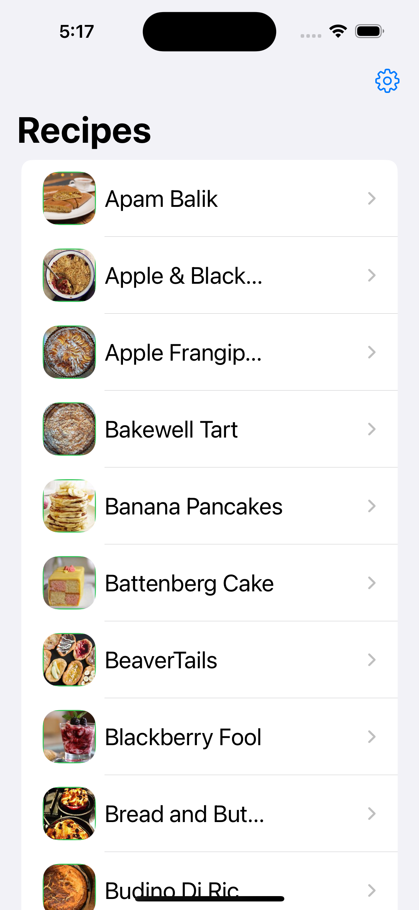
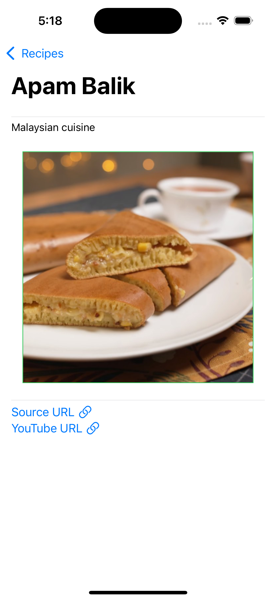
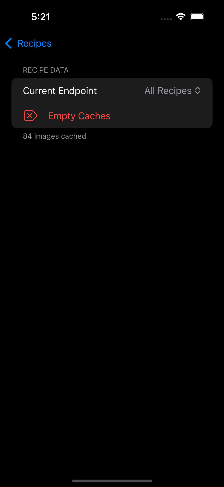

# fetch-recipe

## Approach & Decision Making Process

### Summary: Include screen shots or a video of your app highlighting its features

<div style="display: flex;flex-direction: vertical;">





</div>

### Focus Areas: What specific areas of the project did you prioritize? Why did you choose to focus on these areas?

I prioritized the core functionality of displaying the recipe information (name, photo, and cuisine type) first,
as it was essential for the app to provide value to the user right away. I then focused on implementing image caching,
as minimizing when things are visibly downloading improves user experience. Lastly, I focused on the design of the UI
elements, and though I'm not a good designer by any stretch, its important that apps are dynamic and visual engaging.

### Time Spent: Approximately how long did you spend working on this project? How did you allocate your time?

- For <1hr, I started the project in front of a notebook writing down what I wanted to prioritize and the order I wanted to work
on adding features.
- I struggled to find one block of time to dedicate to the project, but all combined I spent ~6 hours properly
sitting down to work. Here's how that time was spent (and close to the order that I focused on things, though not exactly):

  - <1hr creating the basic views (`ContentView`, `RecipeDetailView`, `RecipeListItemView`, etc.)
  - 1hr creating `RecipesViewModel` and `NetworkManager`, getting them to work together, then `RecipesViewModel` to work with `ContentView`
  - 1hr finalizing the views represented in the minimum viable product
  - 1hr developing `ImageCacheManager` to handle storing images
  - 1hr creating my own `CachedImage` view, which uses `AsyncImage()` if an image isn't in `ImageCacheManager` (and also caches it), and uses `Image()` if it the image is in the cache.
  - 1hr integrating `CachedImage` into the different views and putting some functionality into `SettingsView` to let me change the API endpoint and test caching.
  - <1hr creating unit tests for `ImageCacheManager` and filling out information in this README.

### Trade-offs and Decisions: Did you make any significant trade-offs in your approach?

One trade-off was to only cache images. Ideally I think I would've preferred to cache the full recipe object, but the list
of recipes in the JSON didn't include any pagination or change in any signifcant way. By caching just the images I was able
to spend more time working on the rest of the app.

Another was some kind of bookmark or 'have cooked' feature. I feel like were I using a recipe app I'd want to mark which
recipes I've cooked before, or bookmark them for easier access for later that day. Keeping in mind time constraints for this
interview process, I chose to priority extraneous features less.

### Weakest Part of the Project: What do you think is the weakest part of your project?

The weakest part is definitely the actual UI and design. If I were actually in charge of design choices I'd probably opt for
some technical terminal aesthetic, or something else that is just as inaccessible to larger audiences. I tried to make things
at least clean and presentable, but I'm not going to kid myself about being some great designer 😅

Another weakness is that I wasn't sure how best to limit the data cached. Presently the data is cached without end, which kind
of defeats the purpose of a cache. The values to fix this are readily accessible, but since the API endpoints are all relatively
small I figured it wouldn't be too resource intensive in this limited environment.

One last weakness is I didn't spend as much time writing unit tests as I feel I should have. The two main things I know I wanted
to write unit tests for was `NetworkManager` and `RecipeCacheManager`, but I only got around to writing a few tests for the cache
management. Especially if I were working with any more complex of an API, `NetworkManager` should have gotten more attention. For
example, if there was some kind of `/login` or `/account` endpoints I would've wanted to write unit tests for how those work
when the user isn't authenticated or keeping track of whether all the data is adequetly stored from them.

### Additional Information: Is there anything else we should know? Feel free to share any insights or constraints you encountered

- When it comes to displaying images I handle whether to use an `Image()` or an `AsyncImage()` within my `CachedImage()`. To make
  that distinction clear, `CachedImage()` puts a green border around `Image()`'s that were found in the cache.
- Thanks for your consideration 😁

## My notes

### Endpoints

- All Recipes `/recipes.json`
- Malformed Data `/recipes-malformed.json`
- Empty Data `/recipes-empty.json`

### JSON Structure

|        Key        |  Type  | Required |                            Notes                             |
| :---------------- | :----- | :------- | :----------------------------------------------------------- |
| `cuisine`         | string |   yes    | The cuisine of the recipe.                                   |
| `name`            | string |   yes    | The name of the recipe.                                      |
| `photo_url_large` | string |   no     | The URL of the recipes's full-size photo.                    |
| `photo_url_small` | string |   no     | The URL of the recipes's small photo. Useful for list view.  |
| `uuid`            | string |   yes    | The unique identifier for the recipe. Represented as a UUID. |
| `source_url`      | string |   no     | The URL of the recipe's original website.                    |
| `youtube_url`     | string |   no     | The URL of the recipe's YouTube video.                       |

```json
{
    "recipes": [
        {
            "cuisine": "British",
            "name": "Bakewell Tart",
            "photo_url_large": "https://some.url/large.jpg",
            "photo_url_small": "https://some.url/small.jpg",
            "uuid": "eed6005f-f8c8-451f-98d0-4088e2b40eb6",
            "source_url": "https://some.url/index.html",
            "youtube_url": "https://www.youtube.com/watch?v=some.id"
        },
        ...
    ]
}
```
